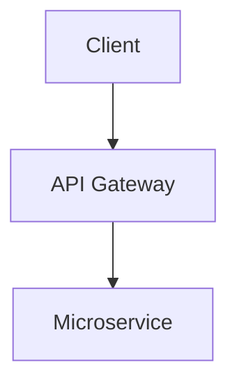

# Morphine Platform Documentation

<div align="center">
  
  <h2>Morphine Platform Documentation</h2>
  <p><em>Computer Vision-Powered Streaming Platform with Real-Time Analytics and Micro-Betting</em></p>
</div>

This directory contains the documentation website for the Morphine Platform, built with Jekyll and hosted on GitHub Pages.

## Site Structure

```
docs/
├── _config.yml          # Jekyll configuration
├── _sass/
│   └── custom.scss      # Custom styles
├── assets/
│   ├── morphine_logo.gif      # Main logo (animated GIF)
│   ├── Morphine2DCSDS.svg     # Chemical structure (secondary)
│   └── Morphine2DCSDS.svg.png # Fallback logo (PNG format)
├── Gemfile              # Ruby dependencies
├── index.md             # Homepage
├── architecture.md      # System architecture
├── computer-vision.md   # CV framework documentation
├── streaming-implementation.md  # Streaming system docs
├── micro-betting.md     # Betting system documentation
├── getting-started.md   # Setup and installation guide
└── api-reference.md     # Complete API documentation
```

## Local Development

### Prerequisites

- Ruby 2.7+
- Bundler
- Git

### Setup

1. **Clone the repository:**
   ```bash
   git clone https://github.com/your-username/morphine.git
   cd morphine/docs
   ```

2. **Install dependencies:**
   ```bash
   bundle install
   ```

3. **Run locally:**
   ```bash
   bundle exec jekyll serve
   ```

4. **View the site:**
   Open `http://localhost:4000` in your browser

### Making Changes

1. Edit Markdown files in the `docs/` directory
2. Save changes - Jekyll will automatically rebuild
3. Refresh your browser to see updates

## Deployment

### GitHub Pages (Automatic)

1. **Enable GitHub Pages:**
   - Go to repository Settings
   - Scroll to "Pages" section
   - Set source to "Deploy from a branch"
   - Select branch: `main` and folder: `/docs`

2. **Automatic deployment:**
   - GitHub will automatically build and deploy when you push to main
   - Site will be available at `https://your-username.github.io/morphine`

### Custom Domain (Optional)

1. **Add CNAME file:**
   ```bash
   echo "docs.morphine.com" > docs/CNAME
   ```

2. **Configure DNS:**
   - Add CNAME record pointing to `your-username.github.io`
   - Update `_config.yml` with your domain

## Content Guidelines

### Adding New Pages

1. Create a new `.md` file in `docs/`
2. Add front matter:
   ```yaml
   ---
   layout: page
   title: Your Page Title
   nav_order: 8
   ---
   ```
3. Add to navigation in `_config.yml`

### Code Examples

Use fenced code blocks with language specification:

```markdown
```rust
pub struct Example {
    field: String,
}
```

### API Documentation

Follow the established pattern in `api-reference.md`:
- Include HTTP method and endpoint
- Show request/response examples
- Document error codes
- Provide SDK examples

### Architecture Diagrams

Use ASCII art or mermaid diagrams:

```markdown

```

## Styling

### Custom CSS

The site uses custom SCSS in `_sass/custom.scss` with:
- Modern color scheme
- Responsive design
- Code syntax highlighting
- Interactive elements

### Components

Available CSS classes:
- `.hero-title` - Large page titles
- `.feature-grid` - Grid layout for features
- `.feature-card` - Individual feature cards
- `.btn` - Styled buttons
- `.cta-section` - Call-to-action sections

## Site Features

### Logo and Branding

The site features a unique animated logo that embodies the platform's cultural and technological fusion:
- **Primary Logo**: `assets/morphine_logo.gif` - Animated GIF featuring cultural elements including African masks, athletic imagery, and Nyau chigure traditions - used on main pages for visual impact
- **Technical Logo**: `assets/Morphine2DCSDS.svg` - Chemical structure used in technical documentation and contexts where scientific precision is emphasized
- **Fallback Logo**: `assets/Morphine2DCSDS.svg.png` - Raster format for compatibility and social media sharing
- **Usage Strategy**: 
  - Animated GIF on homepage, navigation, and marketing-focused pages
  - Chemical structure SVG for architecture, API docs, and technical content
  - PNG fallback for social media and older browser compatibility
- **Styling**: Custom CSS provides hover effects, responsive sizing, animation controls, and accessibility features including reduced motion support

### Navigation

- Automatic table of contents on all pages
- Responsive navigation menu with logo integration
- Breadcrumb navigation

### Search

Jekyll includes built-in search functionality.

### SEO

Optimized for search engines with:
- Semantic HTML structure
- Meta tags
- Social media cards
- Sitemap generation

## Troubleshooting

### Common Issues

**Bundle install fails:**
```bash
gem install bundler
bundle update
```

**Jekyll build errors:**
```bash
bundle exec jekyll build --verbose
```

**Pages not updating:**
- Check GitHub Actions tab for build status
- Verify file permissions
- Clear browser cache

### Local Development Issues

**Port already in use:**
```bash
bundle exec jekyll serve --port 4001
```

**Gem dependency conflicts:**
```bash
bundle update
bundle install
```

## Contributing

1. Fork the repository
2. Create a feature branch
3. Make your changes
4. Test locally
5. Submit a pull request

### Documentation Standards

- Use clear, concise language
- Include code examples
- Add screenshots for UI elements
- Cross-reference related sections
- Keep examples up-to-date

## Resources

- [Jekyll Documentation](https://jekyllrb.com/docs/)
- [GitHub Pages Documentation](https://docs.github.com/en/pages)
- [Markdown Guide](https://www.markdownguide.org/)
- [Liquid Template Language](https://shopify.github.io/liquid/)

## Support

For documentation issues:
- Open an issue in the main repository
- Join our Discord community
- Email: docs@morphine.com 