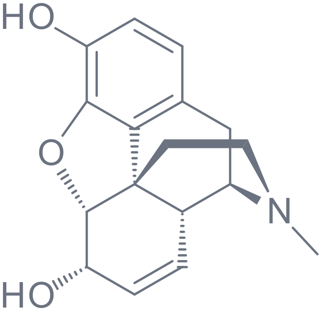
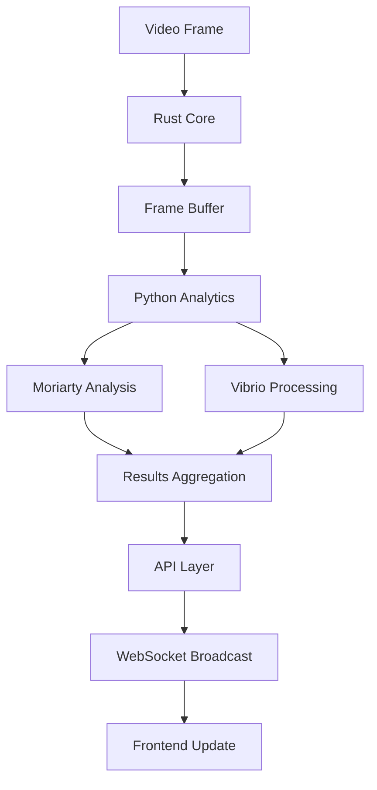

<div class="page-logo">
  
</div>

# System Architecture
{: .no_toc}

## Table of contents
{: .no_toc .text-delta}

1. TOC
{:toc}

---

## Overview

The Morphine Platform is built on a high-performance, multi-language architecture designed for low-latency streaming, real-time computer vision processing, and scalable micro-betting interactions. The system prioritizes performance, reliability, and developer experience.

## Core Architecture

### Multi-Service Design

```
                    ┌─────────────────────────────────────┐
                    │             CDN Layer               │
                    └─────────────┬───────────────────────┘
                                  │
                    ┌─────────────▼───────────────────────┐
                    │          Load Balancer              │
                    └─────────────┬───────────────────────┘
                                  │
        ┌─────────────────────────┼─────────────────────────┐
        │                         │                         │
        ▼                         ▼                         ▼
┌─────────────────┐     ┌─────────────────┐     ┌─────────────────┐
│  Rust Core      │     │  Python ML      │     │  Node.js API    │
│  - Stream Engine│────►│  - CV Processing│────►│  - REST Layer   │
│  - State Mgmt   │     │  - Analytics    │     │  - WebSocket    │
│  - WebRTC       │     │  - Vibrio       │     │  - Auth         │
│  - Protocols    │     │  - Moriarty     │     │  - Routing      │
└─────────┬───────┘     └─────────┬───────┘     └─────────┬───────┘
          │                       │                       │
          └───────────────────────┼───────────────────────┘
                                  │
                                  ▼
                     ┌─────────────────┐
                     │  Next.js Client │
                     │  - Stream View  │
                     │  - Betting UI   │
                     │  - Analytics    │
                     └─────────────────┘
```

### Technology Stack

| Component | Technology | Purpose | Performance Target |
|-----------|------------|---------|-------------------|
| **Stream Core** | Rust | Video processing, state management | < 50ms latency |
| **Computer Vision** | Python + CUDA | Real-time analysis, ML inference | < 100ms processing |
| **API Layer** | Node.js + Express | REST endpoints, WebSocket | < 20ms response |
| **Frontend** | Next.js + React | User interface, streaming client | < 500ms load time |
| **Database** | PostgreSQL + Redis | Persistence and caching | < 10ms queries |

## Component Deep Dive

### 1. Rust Core Services

The core streaming engine written in Rust provides the foundation for high-performance video processing and state management.

**Key Features:**
- WebRTC implementation for low-latency streaming
- Concurrent frame processing using Tokio async runtime
- Protocol Buffers for efficient binary communication
- Memory-safe state management with Arc<RwLock>

```rust
// Core stream processor
pub struct StreamProcessor {
    pub stream_id: String,
    pub viewers: Arc<RwLock<HashMap<String, Viewer>>>,
    pub analytics: Arc<RwLock<AnalyticsState>>,
    pub frame_buffer: Arc<RwLock<FrameBuffer>>,
}

impl StreamProcessor {
    pub async fn process_frame(&self, frame: Frame) -> Result<ProcessedFrame> {
        let start = Instant::now();
        
        // Parallel processing pipeline
        let (encoded, analytics) = tokio::join!(
            self.encode_frame(&frame),
            self.analyze_frame(&frame)
        );
        
        let latency = start.elapsed();
        tracing::info!("Frame processed in {:?}", latency);
        
        Ok(ProcessedFrame { encoded, analytics, latency })
    }
}
```

**Performance Characteristics:**
- Zero-copy memory management
- Lock-free data structures where possible
- SIMD optimizations for video processing
- Custom allocators for frame buffers

### 2. Python Analytics Layer

The analytics layer handles computer vision processing using our custom Vibrio and Moriarty frameworks.

**Architecture:**

```python
class AnalyticsProcessor:
    def __init__(self):
        # Initialize CV frameworks
        self.moriarty = MoriartyPipeline(
            models=['yolov8', 'pose_estimation', 'action_recognition']
        )
        self.vibrio = VibrioAnalyzer(
            features=['object_tracking', 'scene_analysis', 'highlight_detection']
        )
        
        # GPU acceleration
        self.device = torch.device('cuda' if torch.cuda.is_available() else 'cpu')
        
    async def process_frame(self, frame: np.ndarray) -> AnalyticsResult:
        # Parallel processing on GPU
        with torch.cuda.stream(self.stream):
            moriarty_result = await self.moriarty.analyze_async(frame)
            vibrio_result = await self.vibrio.process_async(frame)
        
        return self.merge_results(moriarty_result, vibrio_result)
```

**Key Components:**
- **Moriarty Framework**: Sports-specific analysis and event detection
- **Vibrio Framework**: General computer vision and object tracking
- **CUDA Integration**: GPU acceleration for ML inference
- **Async Processing**: Non-blocking frame analysis

### 3. Node.js API Layer

The API layer provides RESTful services and WebSocket connections for real-time communication.

```typescript
// WebSocket handler for real-time updates
class StreamWebSocketHandler {
  private connections = new Map<string, WebSocket>();
  
  async handleConnection(ws: WebSocket, streamId: string) {
    this.connections.set(ws.id, ws);
    
    // Subscribe to stream updates
    await this.redis.subscribe(`stream:${streamId}:updates`);
    
    // Handle betting events
    ws.on('betting:place', async (bet: BetData) => {
      const result = await this.processBet(bet);
      ws.send(JSON.stringify({ type: 'betting:result', data: result }));
    });
  }
  
  async broadcastAnalytics(streamId: string, analytics: AnalyticsData) {
    const message = JSON.stringify({
      type: 'analytics:update',
      streamId,
      data: analytics,
      timestamp: Date.now()
    });
    
    this.connections.forEach(ws => {
      if (ws.streamId === streamId) {
        ws.send(message);
      }
    });
  }
}
```

### 4. Next.js Frontend

Modern React-based frontend with server-side rendering and optimized streaming components.

```typescript
// Stream viewer component
const StreamViewer: React.FC<StreamProps> = ({ streamId }) => {
  const { stream, analytics, isLoading } = useStreamData(streamId);
  const { placeBet, bets } = useBetting(streamId);
  
  return (
    <div className="stream-container">
      <div className="video-section">
        <WebRTCPlayer 
          stream={stream}
          onMetrics={(metrics) => trackPerformance(metrics)}
        />
        <AnalyticsOverlay 
          data={analytics}
          interactive={true}
        />
      </div>
      
      <div className="interaction-panel">
        <BettingInterface 
          onBet={placeBet}
          currentBets={bets}
          analytics={analytics}
        />
        <ChatInterface streamId={streamId} />
      </div>
    </div>
  );
};
```

## Data Flow & Communication

### 1. Stream Processing Pipeline

```
Video Input → Rust Encoder → Frame Buffer → Python Analytics → API Layer → Frontend
     ↓              ↓             ↓              ↓              ↓
   WebRTC      State Mgmt   CV Processing   WebSocket    React Updates
```

### 2. Real-Time Analytics Flow



### 3. Betting System Integration

```
Stream Event → Analytics → Bet Validation → State Update → UI Update
      ↓             ↓             ↓             ↓            ↓
   CV Detection  ML Analysis   Business Logic  Database   WebSocket
```

## Performance & Scaling

### Latency Targets

| Operation | Target | Measurement |
|-----------|---------|-------------|
| Stream delivery | < 500ms | End-to-end |
| Analytics processing | < 100ms | Frame-to-result |
| Betting confirmation | < 50ms | Click-to-confirmation |
| State updates | < 20ms | Internal propagation |
| API responses | < 10ms | Database queries |

### Scaling Strategy

```
┌─────────────────┐    ┌─────────────────┐    ┌─────────────────┐
│ Horizontal      │    │ Vertical        │    │ Caching         │
│ - API Layer     │    │ - Analytics GPU │    │ - Redis Cluster │
│ - Frontend      │    │ - Database CPU  │    │ - CDN           │
│ - Stream Nodes  │    │ - Memory        │    │ - Edge Compute  │
└─────────────────┘    └─────────────────┘    └─────────────────┘
```

## Infrastructure & Deployment

### Docker Architecture

```yaml
version: '3.8'
services:
  rust-core:
    image: morphine/rust-core:latest
    ports: ['8080:8080']
    environment:
      - RUST_LOG=info
      - TOKIO_WORKER_THREADS=8
    
  python-analytics:
    image: morphine/analytics:latest
    runtime: nvidia  # GPU support
    volumes: ['/dev/dri:/dev/dri']
    
  nodejs-api:
    image: morphine/api:latest
    ports: ['3001:3001']
    depends_on: [redis, postgres]
    
  nextjs-frontend:
    image: morphine/frontend:latest
    ports: ['3000:3000']
    environment:
      - NODE_ENV=production
```

### Monitoring & Observability

- **Metrics**: Prometheus + Grafana
- **Logging**: Structured logging with tracing-subscriber (Rust), Winston (Node.js)
- **Tracing**: Distributed tracing with Jaeger
- **Health Checks**: Custom health endpoints for each service

## Security Architecture

### Authentication & Authorization

```
Client → JWT Token → API Gateway → Service Mesh → Microservices
  ↓         ↓            ↓             ↓             ↓
Browser   Auth0     Kong/NGINX    Istio        Business Logic
```

### Data Security

- **Encryption**: TLS 1.3 for all communications
- **Stream Security**: End-to-end encrypted video streams
- **API Security**: Rate limiting, CORS, input validation
- **Database Security**: Encrypted at rest, row-level security

---

## Next Steps

- [Computer Vision Deep Dive](/computer-vision) - Explore Vibrio and Moriarty frameworks
- [Streaming Implementation](/streaming) - Learn about the video streaming system
- [Micro-Betting System](/micro-betting) - Understand the betting mechanics
- [Getting Started](/getting-started) - Set up your development environment 